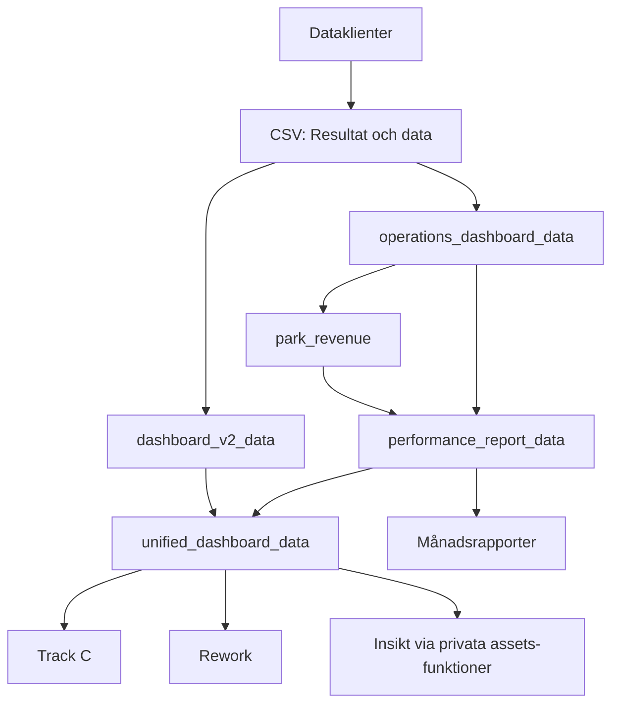
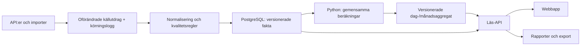

# Elpris — nytt analysrum för parker och elmarknad

Datum: 2026-09-08. Status: arkitekturgranskning och första fungerande lokala dashboard. Målbild och fortsatt teamdrift beskrivs separat från det som är byggt.

## Rekommendation

Bygg en sammanhållen analysapplikation med gemensamma tidsval, spårbara nyckeltal och sparade analyser. Behåll Python som beräkningsmotor. Flytta beräkningar ur dashboardbyggarna till tydliga domänmoduler och låt ett separat webbgränssnitt fråga efter den data som behövs.

Produktens sammanhållande idé är **från observation till förklaring, med minne över tid**. Välj en park, en marknad eller ett leveranskontrakt. Välj period. Jämför med en relevant referens. Öppna underlaget. Spara analysen antingen som en levande vy eller som ett låst beslutsunderlag.

Bekräftat av användaren: intern analys och uppföljning för Pontus och teamet; 23/24 avser både kalender-/handelsår och leveranskontrakt; första leveransen ska vara en fungerande dashboard med befintliga data. Den första versionen körs lokalt i projektet. Extern investerarportal och batteriberäkningar följer senare.

## Vad granskningen omfattar

Genomgång av dataklienter, lagring, centrala capture-/intäkts-/PR-beräkningar, futuresladdning, budget/PPA, pipeline, testurval och frontendkopplingar. Track C, Rework och Insikt har även öppnats i webbläsare. Webbprototypen `portfolio_hub_prototype` har granskats genom dess produktbeskrivning, beroenden och databasschema. Dess översiktsvärden är enligt README illustrativa.

En reproducerbar, lokal inventering finns i [audit-scriptet](../../scripts/audit_dashboard_architecture.py) och [resultatet](../insights/2026-09-08-dashboard-input-audit.json). Den omfattar 61 spot-, park- och futuresfiler och 1 363 537 inlästa rader, inklusive både råa och bearbetade spotrader. Det är inte ett antal unika marknadsobservationer. Varje fil har SHA-256. Ingen extern datakälla uppdaterades vid granskningen.

48 befintliga tester passerade för futureshistorik, Nasdaq, operations, performance och parkintäkt. Detta är ett riktat baslinjetest, inte ett fullständigt kvalitetsgodkännande. CI kör idag bara en explicit delmängd av testfilerna.

## Dagens arkitektur och vad den betyder

Det finns redan bra byggstenar: källspecifika klienter, retry/fellogg, CSV-merge, UTC-parser, separata park- och marknadsprofiler, verklig parkcapture, budgetar, inverterdata och deterministiska insiktsregler. De ska återanvändas efter verifiering.

Problemet ligger främst i kopplingarna. `generate_report()` räknar parkintäkt för hela portföljen; dashboarden skapar rapporter för många parkmånader; Insikt behöver därför patcha importerade funktioner med en processglobal cache. `dashboard_v2_data` blandar laddning, capture, terminer och BESS. Track C-renderaren är 5 276 rader Python med inbäddad frontend. Rework och Insikt gör nya presentationer men behåller stora delar av samma beroendekedja.

Den senaste lokala Track C-filen är 4,32 MB, Rework 0,52 MB och Insikt 0,32 MB. Äldre Track C-filer var 17–18 MB. Payloaden har alltså förbättrats, men användarens nya frågor kräver ett frågebart datalager, inte bara ytterligare beskärning av en rapportfil.

### Fynd som måste hanteras innan nya KPI:er blir officiella

| Prioritet | Belägg i befintlig kod/data | Konsekvens och åtgärd |
|---|---|---|
| P1 | `operations_dashboard_data.py:73–89`: tom mätare blir 0; fallback används när `power > 0` är falskt. | Verklig noll/nätimport skiljs inte från saknad signal. Bevara originalvärde och giltighet; välj inverter endast enligt uttrycklig fallbackregel och märk energin som uppskattad nätleverans. Fortsätt använda `effective_power_mw` i befintliga konsumenter tills den gemensamma definitionen är korrigerad. |
| P1 | Park och rå spot slutar 2026-08-13, `data/quarterly` slutar 2026-07-28 för alla fyra zoner. | Juliproduktion jämförs med capture för en kortare period. Bara cirka 86,9 % av positiv effektiv portföljenergi i juli kan prismatchas med dagens bearbetade data. Publicera täckning och gemensam period per KPI; använd inte senaste fildatum som kvalitetsgodkännande. |
| P1 | Hörby har POA-värde i 7,96 % av juli månads förväntade intervall. `_check_data_flags` kräver bara ett värde; rapportens PR använder hela energin mot tillgänglig POA. | Rapportens väder-/PR-förklaring kan vara missvisande. Visa otillräckligt underlag, inte en säker väderorsak. Räkna energi och POA på identiska giltiga intervall och mät även dagsljustäckning. 7,96 % avser alla kvartar, inte dagsljus. |
| P1 | `load_forward_curve_data`: saknad EPAD hämtas med default 0. | SYS kan visas som om det var ett SE-pris. SYS + saknad EPAD ska ge saknat områdespris, med förklaring. Behåll samma värdedag och leveransperiod för båda benen. |
| P1 | Futuresformatet saknar källa, ursprungligt instrument-ID, observations-/inläsningstid och handlad volym. Nasdaq- och Euronextvärden skrivs till samma symboler. | Det går inte säkert att skilja källor, enheter och senare rättelser. Ny kontraktsmodell och separat observationshistorik krävs. Särskilt OI-enheten måste verifieras vid leverantörsbytet. |
| P2 | Operations-loadern sätter dag/månad i UTC; rapporten filtrerar dem direkt. Parkintäkt använder `local_year_month`. | Samma månad kan innehålla olika intervall. Alla affärsperioder ska definieras i Europe/Stockholm, med UTC-gränser för join. I auditens juli är Fjällskär 3 412,07 MWh jämfört med Insikts cirka 3 421 MWh; detta är en diagnostisk skillnad, inte en avstämd rättning. |
| P2 | PPA har bara pris och andel. Beräkningen tillämpar dagens inställning på all historik; saknad FX kan falla tillbaka till spot. | Resultatet är en förenklad intäktsmodell. Giltighetsdatum, volymform, valuta, negativa-prisvillkor och avräkning måste modelleras innan det kallas kontraktsutfall. Saknad FX ska vara saknad värdering. |
| P2 | `forward_history` innehåller bara kontrakt som börjat levereras. `lookback_value` använder närmaste datum ±7 dagar. | Befintlig historik för 2027/2028 göms. En jämförelse kan använda en notering efter valt historiskt datum. Visa alla kontrakt och välj endast observationer på eller före datumet. |
| P2 | `is_partial` härleds från pågående kalendermånad; budget proportioneras med antal dagar med data. | En gammal månad kan vara datamässigt ofullständig och ändå visas som stängd. Saknade dagar kan minska referensbudgeten. Separera kalenderstatus, datatäckning och godkänd rapportstatus; jämför MTD med budget för samma tidsfönster. |
| P2 | `insikt/cache.py` patchar modulreferenser; breda exceptions ersätts ibland med tomma resultat. | Svårt att återanvända i en långlivad server och att skilja databortfall från beräkningsfel. Inför körningskontext, explicita fel och cache per dataversion. |

Hovas diagnostiska PR överstiger 100 % i juni/juli. Det är en anledning att kontrollera POA, sensorns montage, bifacial referens, kapacitet och fallback — det räcker inte för slutsatsen att parken eller trackern presterar bättre. Detsamma gäller enkla jämförelser mellan Hova och andra geografiska parker.

## Ny produktstruktur

### Översikt — vad förändrades och vad kräver undersökning?

En gemensam period och park-/zonselektion. Tre huvudmått: produktion, avvikelse mot periodens budget och parkcapture. Visa kvalitet intill värdet. En prioriterad lista leder till relevanta undersökningar: energiavvikelse, förändrat marknadsvärde eller saknat underlag. Rangordna faktiska observationer; märk möjliga orsaker som hypoteser.

### Parker — hur producerar tillgångarna?

Jämförelsetabell och parkdetalj som behåller periodvalet. Produktion, specifik yield, PR, PI, POA och tillgänglighet. Tidsserie mot budget, föregående motsvarande period och väderkorrigerad referens. Klick från månad till dag till kvart. Mätare och inverter visas separat i diagnostiken. Driftstopp, larm och underhåll läggs på samma tidsaxel.

Förlustbryggan ska vara bokföringsmässigt sammanhängande och skilja observerade bidrag från modellerade och residual. En residual får inte presenteras som uppmätt curtailment. Sparade förklaringar kan bära status ”möjlig orsak”, ”utredd” eller ”bekräftad”.

### Elmarknad — vad händer med priserna?

En ren prisutforskare ska vara ett fullvärdigt arbetsflöde. Spot för SE1–SE4, dag/kvart/månad/år, negativa timmar, prisfördelning, varaktighetskurva, dygnsprofil och zonspread. Åren 2023 och 2024 finns lokalt för spot och kan jämföras nu. Källnamnet ska vara ”day-ahead via elprisetjustnu.se”; direkt Nord Pool-anslutning är en egen adapter.

Capture läggs över samma period: **verklig park**, **regional ENTSO-E-produktion** eller **PVsyst-modellprofil** är tre olika referenser med tydliga etiketter. Visa både EUR/MWh och EUR/kWp när orientering jämförs. Near-zero/negativ baseload kräver särskild tolkning av ratio; visa då även differensen i EUR/MWh.

### Terminer — hur såg marknadens prisbild ut då?

Tre kompletterande vyer:

1. **Kontrakt över tid.** Välj exempelvis SYS baseload, leverans 2024. X-axeln är handels-/värdedag före leverans. Separata paneler för settlement, handlad volym och open interest.
2. **Kurvan vid ett datum.** Välj 2022-09-01 och jämför exempelvis med 2022-12-01. X-axeln visar leveransperioder; varje linje är en historisk marknadsbild. SYS och EPAD kan inspekteras var för sig.
3. **Före leverans mot utfall.** Jämför T−24/12/6/3/1 månader och sista tillgängliga settlement med leveransperiodens faktiska benchmark. Tiden till leverans gör årskontrakt jämförbara. Pågående leverans visas som partiell.

Systemkontrakt jämförs med **SYS-spot**, som saknas lokalt. SYS+EPAD för SE3 jämförs med SE3-spot för samma leveransperiod. En serie får inte automatiskt rullas från ett årskontrakt till nästa; kontinuerliga kontrakt är en separat, dokumenterad analys.

Saknad historik syns som en lucka. Grafen binder inte ihop långa insamlingsuppehåll som om dagliga värden fanns. Varje referenspunkt visar faktiskt källdatum och ålder. En offentlig dagsbild efter ett uppehåll kan inte fylla tidigare dagar.

### Intäkt & avtal — vad tjänar vi på den levererade elen?

Brygga från uppmätt leverans och spotvärde till kontraktsersättning, avräkning och kostnader. Jämför spotexponering och PPA-volymer över avtalsperioden. En pay-as-produced-PPA ska jämföras med relevant solprofil, period och valuta; en generell baseloadtermin räcker inte som värdering.

Första versionen kan visa befintlig PPA-modell tydligt märkt som antagande. Faktiskt avräknad intäkt kräver avräkningsunderlag. Faktisk obalanskostnad kräver sparade nomineringar/prognoser och avräkning; befintliga eSett-simuleringar hör hemma under scenarier.

### Sparade analyser och underlag

Samma analys kan sparas på två sätt: en **levande vy** återanvänder filter mot senaste godkända data, ett **låst underlag** bevarar data-, beräknings- och avtalsversion. Koppla kommentarer och beslut till dessa, inte till ett filnamn med ”senaste”. Export och diagram använder samma fråga och beräkning. En datadetalj visar enhet, definition, källor, täckning, fallbackandel och beräkningsversion.

Batterier blir senare ett eget scenarioområde med samma tidserie- och kontraktsgrund. Sparade scenarier ska innehålla nätgräns, MW/MWh, verkningsgrad, degradering, cykelkostnad, budacceptans och prognosantaganden. Befintlig DP med perfekt prisframsyn märks fortsatt som teoretisk potential.

## Futures: faktisk tillgång och nästa datasteg

Den lokala SYS-filen har 8 592 rader och 22 kontrakt. Värdedatum börjar 2024-01-02 och slutar 2026-08-14, men det betyder **inte** att leveranskontrakten 2023/2024 finns: de saknas. Äldsta kvartalsleverans är Q1-2026; årskontrakten gäller 2027–2036. Handlad volym saknas som kolumn. Open interest finns delvis och ska varken kallas dagsvolym eller summeras som omsättning.

Marknaden är nu Euronext Nord Pool Power Futures. Migreringen av öppna positioner genomfördes 14 mars 2026 och hela kontraktsutbudet handlas där från 16 mars. Det nya instrumentregistret måste bevara kopplingen mellan börsernas ID:n och kontraktens ekonomiska villkor. [Nord Pool](https://www.nordpoolgroup.com/en/trading/euronext-nord-pool-power-futures-market/), [Euronexts mappningsfiler](https://live.euronext.com/en/products/power-derivatives/mapping).

Repoanteckningen från augusti visar att det odokumenterade Nasdaq-API:t inte gav en fungerande backfillväg. Den bevisar inte att historiken är permanent förlorad hos börs eller dataleverantör. Nasdaq har ett formulär för historikförfrågningar som omfattar Commodities och specifika instrument. Exakt tillgång till 2023/2024, fält, enheter, användningsrätt och kostnad behöver bekräftas. [Nasdaqs historikformulär](https://www.nasdaqtrader.com/Content/AdministrationSupport/AgreementsData/Nordic_Baltic_Request_Form.pdf).

Konkret förfrågningsunderlag: Nordic SYS annual baseload för leverans 2023 och 2024, från första notering till sista handel; dagligt settlement, börshandlad och rapporterad OTC-volym separat, OI, bud/sälj där tillgängligt, enheter och kontraktsstorlek, symbol/ISIN/börs-ID, kalender, kaskadering och rättelser. Lägg till svenska EPAD-kontrakt om områdesjämförelse behövs. Begär ett provutdrag innan integration eller köp. Ingen förfrågan eller beställning har skickats.

För kommande dagar: komplettera Euronext-adaptern med källarkiv, ID:n, faktisk värdedag, tydliga enheter och volym om det verifieras i källan. En ändrad HTML-layout får inte tyst skapa tomma data eller sätta dagens datum. Kontrollera saknade kontrakt och avvikande radantal efter varje körning. Historiska luckor förblir en separat återhämtningsuppgift.

## Föreslagen teknisk arkitektur

En **modulär monolit**: ett kodprojekt, en Python-tjänst för API och jobb, en PostgreSQL-databas, ett React/TypeScript-gränssnitt. Jobb körs i separat process så tunga analyser inte blockerar användarna. Vite räcker för en intern analysapp; SSR är inte ett krav. FastAPI ger ett typat API nära dagens beräkningar. Detta är ett arkitekturval, inte ett uppmätt prestandalöfte. [FastAPI](https://fastapi.tiangolo.com/), [Vite](https://vite.dev/guide/).

PostgreSQL väljs för relationerna mellan tidsserier, kontrakt, versioner, budgetar och sparade analyser samt samtidig läsning/skrivning. MVCC hjälper konsistens under körning, men är **inte** en historikfunktion som ersätter uttryckligt sparade dataversioner. Någon extra tidsseriedatabas behövs inte innan profilering visar behov. [PostgreSQL](https://www.postgresql.org/docs/current/mvcc-intro.html).

Lokal pilot kan köras på samma dator. Innan teamdrift flyttas jobb till en alltid tillgänglig miljö, med inloggning via organisationens identitetsleverantör, serverstyrd åtkomst till PPA och backup med provad återläsning. Val av värd görs efter miljö- och åtkomstkrav; databasschemat binds inte till en frontendleverantör.

### Datamodell: olika fakta har olika tidskorn

| Tabell/familj | Korn och viktig information |
|---|---|
| `assets`, `asset_versions` | Park-ID, zon, kapacitet, COD, mätpunkter, teknik; giltighetsperioder och källreferens. |
| `ingest_runs`, `source_objects` | Hämtningstid, utfall, källfil/hash, parser-version, antal rader, luckor. |
| `spot_observations` | Zon/SYS, marknad, intervall start/slut, originalupplösning, EUR/MWh, SEK/MWh, FX, revision. |
| `production_observations` | Park och mätpunkt per intervall; grid/inverter/POA/availability med originalvärden och giltighetsflaggor. Effekt MW och energi MWh hålls isär. |
| `instruments`, `instrument_aliases` | Stabilt ekonomiskt kontrakt; börs-ID:n med giltighet, SYS/EPAD, leveransperiod, baseloadform, valuta, storlek, handelskalender och kaskadrelation. |
| `futures_observations` | Instrument + värdedag + källa + revision; settlement, bid/ask, börsvolym, OTC-volym, OI och respektive enhet. |
| `budget_versions`, `budget_periods` | Park, giltigt budgetscenario, PVsyst-källa och periodvärden; revisions- och beslutsdatum. |
| `ppa_versions`, `ppa_allocations` | Avtal, giltighet, pris/valuta, pay-as-produced eller fast profil, andel/MW/MWh, villkor och fördelning till parker. |
| `metric_versions`, `metric_results` | Definition, indatarevisioner, numerators/denominators, tidsperiod, kvalitet och beräkningsversion. |
| `analysis_views`, `report_snapshots` | Filter eller låst dataset-/resultatversion, skapare, kommentarer och exportmetadata. |

Använd tydliga tabeller med enheter och unika nycklar; undvik en universell ”allt är observationer”-tabell som även försöker rymma dagsfutures, PPA-villkor och kvartsmätningar. Behåll timprisets ursprung även om ett härlett kvartslager behövs för join.

### Tid och återskapande

För terminer behövs **leveransperiod**, **värdedag**, eventuell **publiceringstid** och **inläsningstid**. De är olika saker. Frågan ”vad prissatte marknaden då?” filtrerar värdedag och, där känt, publiceringstid. Frågan ”vad visste vårt system då?” filtrerar också inläsningstid och den revision som fanns då. Historik som importeras nu får inte påstås ha funnits i vårt system 2022.

Nya rättelser läggs som versioner. Ett aktuellt index pekar på senaste godkända version; låsta rapporter pekar på sina ursprungliga revisioner. Första importen av befintliga CSV:er blir en märkt baslinje: tidigare inläsningshistorik kan inte rekonstrueras från filer som skrivits över.

För spot och produktion används UTC för intervallnycklar och svensk tid för valda dagar/månader. Intervall är halvöppna `[start, end)`. Energi = effekt × faktiskt antal timmar. Testa 23/25-timmarsdagar, skottår och övergången timme/kvart. Dagsfutures är inte 96 konstgjorda kvartsvärden.

### Beräkningskontrakt

Varje resultat bär `value`, `unit`, `period_start/end`, `data_through`, `coverage`, `quality`, `metric_version`, `dataset_version` och källreferenser. PR bär dessutom giltigt energi-/POA-par och kapacitetsversion; capture bär matchad energi och spotperiod. Saknat resultat har `null` och en orsak, aldrig en automatisk nolla.

Portföljcapture = summa spotvärde / summa matchad energi. Portfölj-PR = summa giltig energi / summa parkvis referensenergi, inte snitt av procentsatser. PPA-modellvärde, avräknad intäkt och spotvärde har skilda namn. Modellerade temperatur- och clippingbidrag behåller sina antaganden.

Beräkningar är rena funktioner över en avgränsad indatamängd. Ett `RunContext` tillhandahåller parker, priser, budgetar, version och klocka en gång per körning. De ska inte läsa alla CSV-filer, importera en renderare eller använda `date.today()` dolt. Inkrementell uppdatering räknar om påverkade park-/zonperioder och publicerar färdig datasetversion atomiskt.

Exempel på API-kontrakt: `GET /api/parks/{id}/performance?from=…&to=…`, `/api/market/spot?zone=…&grain=…`, `/api/futures/{id}/history`, `/api/futures/curve?as_of=…`, `/api/metrics/{id}/lineage`. Export frågar samma tjänster; filtren lagras i URL och sparade vyer. Tunga framtida batterikörningar ger ett jobb-ID och en separat resultatversion.

## Återanvändning och flytt

| Befintlig del | Hantering |
|---|---|
| `api`, `bazefield`, `entsoe`, `esett`, `mimer`, `temperature` | Behåll källkunskap och parser-tester; skriv genom gemensamt inläsningsgränssnitt. |
| `nasdaq` | Dela i Nasdaq-historik och Euronext-adapter; extrahera instrumentregister och futuresdomän. |
| `operations_dashboard_data`, `park_revenue`, `performance_report_data` | Extrahera intervalldata, energival, capture, PR och förlustmodeller till publika domäntjänster. Verifiera fynden ovan innan siffror förs över. |
| `dashboard_v2_data`, `unified_dashboard_data` | Bevara som äldre konsumenter under övergången; ny frontend får inte bero på deras kompletta payload eller privata funktioner. |
| `park_config`, `park_product_data` | Importera till versionerad masterdata/budget/avtalsgrund, bevara ursprungskälla. |
| `rework_*`, `insikt/*` | Återanvänd utvalda analyser och regelinsikter med kvalitetsvillkor. Behåll obalansproxy, korrelation och BESS åtskilda från observerade resultat. |
| HTML-renderare och tidigare webbprototyp | Designreferens och regressionsexempel; den nya appens informationsstruktur byggs från användarfrågorna. |

Föreslagen struktur: `elpris/domain/{production,market,futures,revenue}`, `elpris/ingest`, `elpris/storage`, `elpris/services`, `apps/api`, `apps/web`. Befintliga filnamn kan successivt bli kompatibilitetslager. Ingen stor flytt behövs innan den första sammanhängande funktionen fungerar.

## Leverera i små, kompletta etapper

| Etapp | Användbart resultat | Klart när |
|---|---|---|
| 1. Gemensam grund + park/spot | Alla åtta parker, SE1–SE4, månad/dag, produktion, budget, capture och kvalitet. | Grid/noll/saknat särskiljs; tid och täckning stämmer; två representativa parkmånader kan följas från graf till råintervall; stale bearbetade spotfiler orsakar inte tyst prisbortfall; grafer och export överensstämmer. |
| 2. Parkprestanda | PR/PI, POA, referenser och undersökning av avvikelser. | PR räknas på matchade intervall; sensorbrister stoppar säkra orsaksutsagor; rapportvärden är avstämda mot definierad referens. |
| 3. Terminsminne | Kontraktshistorik, jämförbara kurvdatum och volym/OI. Datakällespåret för 2023/2024 kan starta redan i etapp 1. | Alla lokala kontrakt kan väljas; ingen framtida information i historiska vyer; luckor och källbyten syns; provleverans av 2023/2024 och volym är verifierad eller explicit saknad. |
| 4. Avtal + uppföljning | PPA-perioder, intäktsbrygga, levande vyer och låsta underlag. | Ändrat avtal påverkar rätt period; vald rapport kan återskapas exakt; antaganden och faktisk avräkning särskiljs. |
| 5. Batterier | Reproducerbara scenarier på samma valda pris- och parkdata. | Begränsningar, prognosläge och överlapp mellan intäktsströmmar är verifierade; modellen jämförs mot en enkel baslinje. |

Första pilotens mål är en snabb första laddning av förberäknade aggregat och omedelbart filterbyte för normal användning; sätt mätbara svarstidsbudgetar när miljön är vald. Ett grafbyte ska aldrig starta en portföljomfattande rapportgenerering.

Testerna ska skydda affärsregler: noll kontra saknat, identiska tidsmängder, ofullständiga månader, saknad EPAD/FX, rättelse och reproduktion, bakåtriktat as-of-val, volymenheter och avtalsgiltighet. Kör dessa i CI; använd små syntetiska fixturer och ett fåtal avstämda datautdrag. Långa fullbyggen är separata integrationstester.

## Frågor att avgöra när produkten konkretiseras

- Vilka officiella PPA-villkor, avräkningsfiler och Nord Pool-/historikabonnemang finns redan i organisationen?
- Vilken källa är beslutad master för nätleverans, parkbudget och avtalsversioner?
- Vilken intern miljö och inloggning ska teamet använda?

Dessa frågor ändrar anslutningar och prioriteringar. De hindrar inte den första lokala, spårbara park- och marknadsvyn.

## Implementerat i denna leverans

Körinstruktioner finns i [energy_dashboard/README.md](../../energy_dashboard/README.md).

- En ny React-applikation i `energy_dashboard`, med Vinext/Vite, shadcn/Base UI och Recharts. Layout, navigation och analysflöden är frikopplade från de tidigare Python-renderarna.
- `elpris/intelligence_data.py` läser råa spotfiler och Bazefield-data en gång per export samt hela lokala terminsarkivet. Befintlig tidsparser och park-/budget-/PPA-metadata återanvänds. De nya beräkningarna importerar ingen gammal dashboard.
- Fem fungerande arbetsytor: Portföljen med parkdetalj, Elmarknaden, Terminer, Intäkt & PPA samt Underlaget. CSV-export och URL-baserade urval finns. En kopierad URL är en levande vy; den utgör inte ett låst beslutsunderlag.
- Parkprestanda visar månadsproduktion, specifik yield, budget, preliminär matchad PR, capture och datatäckning. Parkdetaljen når dag/kvart, inverterestimat, tillgänglighet, capture rate och export vid negativa priser. KPI:er är inte avstämda mot ekonomisk avräkning.
- Spotutforskaren jämför kalenderår och visar månads-, dags- och kvartsvärden, negativa timmar, dygnsprofil och varaktighet. Den använder råa spotfiler genom 13 augusti; därmed finns pris för all känd juli-export i den nya definitionen.
- Terminer visar alla 64 lokala instrumentserier, handelsdatumfilter, SYS eller beräknat SYS+EPAD, historiska årskurvor och T−24/12/6/3/1. YR-23/24 är uttryckliga tomlägen. Ingen volym eller OI-enhet hittas på.
- Varje komplett export får en kontrollsummebaserad datasetversion och en oföränderlig katalog. Indexet byts atomiskt efter lyckad export. En misslyckad export lämnar föregående index tillgängligt. Äldre källrevisioner före första exporten kan fortfarande inte återskapas.

### Första dataversionens omfattning

41 käll- och definitionsfiler, åtta parker, fyra spotområden och 64 kontrakt. Årsfilerna för spot 2023 och 2024 har 35 040 respektive 35 136 normaliserade kvartar per zon. 52 härledda spotkvartar har en belagd korrigering av felaktig sluttid runt höstens tidsomställning, över alla zoner och år. Ursprungliga filer är oförändrade.

Pilotens strängare energival skiljer sig från tidigare rapporter. Exempel: Hörby i juli blir cirka 608 MWh observerad/estimerad nettoenergi med 32,3 % energitäckning. Det är **inte** en slutsats om månadens verkliga produktion. En giltig mätarnolla behålls, och en orimlig inverterserie blir saknad. Parken ska utredas mot originalsignaler och avräkning innan officiell rapportering ändras. Befintliga rapporters beräkningsbeteende är därför inte ändrat i denna leverans.

PR-tröskeln i piloten är 95 % matchad POA-täckning av alla förväntade intervall. Det är en konservativ, preliminär regel; inför officiell PR behövs även dagsljustäckning, sensorvalidering, kapacitetsversion och beslut om nettomätare kontra inverterreferens. Verifierat PR över 100 % ska inte antas utan utredning.

### Kvar till målarkitekturen

PostgreSQL, FastAPI, organisationsinloggning, schemalagd import, gemensamma sparade analyser, kommentarer, avtalsversioner och BESS är **inte** implementerade. Den lokala JSON-exporten är ett användbart första läslager som kan ersättas med API-frågor bakom samma UI. Det finns inga klientnycklar och ingen direkt dataimport från webbläsaren. En produktionsbyggd app måste byggas om efter att ett nytt datautdrag genererats; utvecklingsservern läser det nya indexet vid omladdning.

### Verifiering

- 48 riktade befintliga tester passerade före arbetet; tidigare implementationer är oförändrade.
- Nio nya Python-tester skyddar noll/saknat/fallback, fastlåst signal, signerad nätimport, DST, konflikter, matchad PR, saknad FX, as-of och atomisk publicering vid misslyckad export.
- Sex JavaScript-tester skyddar as-of, gemensamma SYS/EPAD-datum, tidsserieluckor, upprepad hösttimme och säker CSV-export.
- Hela lokala exporten verifierad: kvart → dag → månad ger samma parkenergi; spot 2023/2024 har väntat intervallantal och samma viktade årsmedel från månad respektive kvart; täckningsmåtten håller sina gränser.
- TypeScript, appens lint och produktionsbygget passerar. Genererade shadcn-komponenter har avgränsade lint-undantag för scaffoldens generiska wrappers; egna analyskomponenter omfattas av kontrollerna.
- Beroendena uppdaterades från scaffoldens versioner; npm audit rapporterar noll kända sårbarheter vid byggtillfället. Detta ersätter inte en säkerhetsgranskning inför teamdrift.
- Browserns två analysverktyg registrerades med förväntade scheman och annoteringar. Ett giltigt arbetsyte-/period-/zonval följdes av återläsning av samma appstate; ett ogiltigt val avvisades utan att ändra state. Kontrollen gjordes i den lokala produktionsbyggda appen. Bred visuell granskning eller klicktest av samtliga gränssnittskontroller ingick inte.
